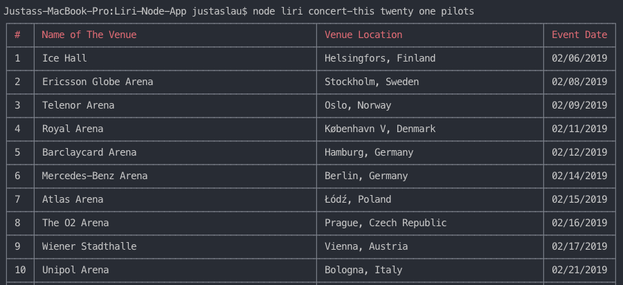
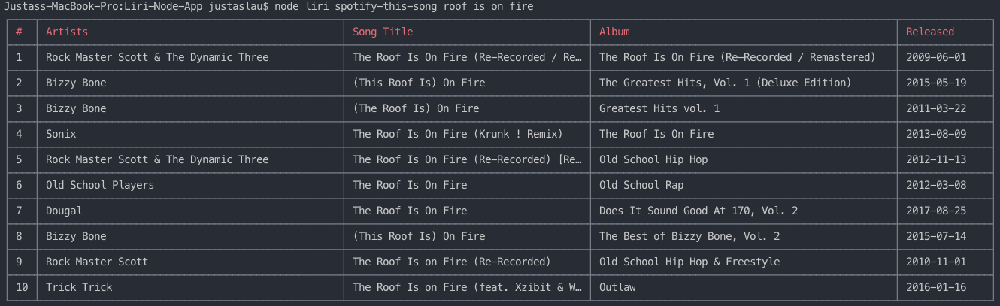
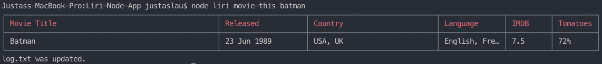
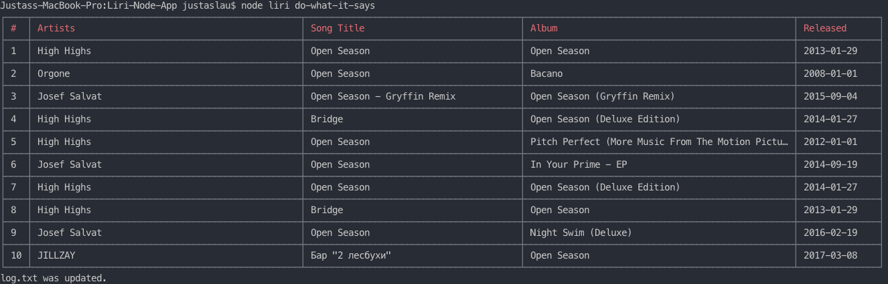

# Liri-Node-App
LIRI is like iPhone's SIRI. However, while SIRI is a Speech Interpretation and Recognition Interface, LIRI is a Language Interpretation and Recognition Interface. LIRI will be a command line node app that takes in parameters and gives you back data and logs data and commands to TXT file.

## Commands
In the command line, the user types in one of 4 commands:
- `concert-this` to find event information by passing argument (event name) 
- `spotify-this-song` to find songs by passing argument (song name)
- `movie-this` to find movie by passing argument (movie name)
- `do-what-it-says` to run command from random.txt file

## concert-this
The user types in `concert-this` and the name of a band/artist and liri.js takes that information and makes a call to the **Bands in Town API**. The output displays the name of the venue, venue location, and date of the event.




## spotify-this-song
The user types in `spotify-this-song` and the name of a song. liri.js takes that information and makes a call to the **SPOTIFY API**. The output displays the artist name, song name, and the album that the song is from. If the user does not initially specify a song, then 'The Sign' by Ace of Spades is displayed.



## movie-this
The user types in `movie-this` and the name of a movie. liri.js takes that information and makes a call to the **OMDB API**. The output displays the title of the movie, year, imdb rating, rotten tomatoes rating, country where it was produces and language of the movie.



## do-what-it-says
The user types in `do-what-it-says` and the liri.js file reads the random.txt file and runs that in the command line.  
**readme.txt**
```
spotify-this-song,"Open Season"
```
**Result**




## log.txt file

Once the user inputs the info that they are looking for, that output is then appended to a 'log.txt' file.
In this case, the user utilized all of the commands.
